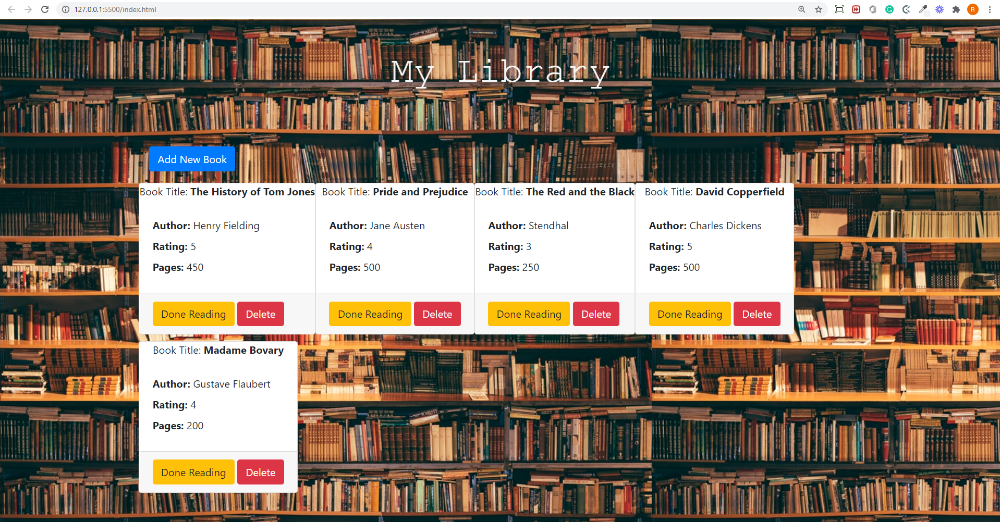

# Library

> This projects depicts how to use Objects and Contructors using Javascript.

Using this project, you can create your own library where you can specify Title, Author, Rating, Number of pages and if you have already read that book.
All the book created will be stored in local storage so you don't lose data on page reload. 

## Built With

- Javascript ES6
- HTML5 and CSS3
- Bootstrap
- VS Code

## Live Demo

[Live Demo Link](https://rawcdn.githack.com/rajkumardas2701/Library_JS/e4e2fc2d026910c2a9459a835e86276539c1d9dc/index.html)

### Prerequisites

- Any kind of browser supporting CSS3 and HTML5

### Setup

- Fork the repo to your remote repository.
- Clone or download the repository to your local machine.

### Install

- No istallation required.

## Author

👤 **Rajkumar Das**

- Github: [@rajkumardas2701](https://github.com/rajkumardas2701)
- Twitter: [@Rajkuma58621299](https://twitter.com/Rajkuma58621299)
- Linkedin: [Rajkumar Das](https://www.linkedin.com/in/rajkumar-das-41308961/)

## 🤝 Contributing

Contributions, issues and feature requests are welcome!

Feel free to check the [issues page](https://github.com/rajkumardas2701/Library_JS/issues).

## Show your support

Give a ⭐️ if you like this project!

## Acknowledgments

Thanks to Team 104 the fornax at Microverse for sharing learning contents

## 📝 License

This project is [MIT](lic.url) licensed.
